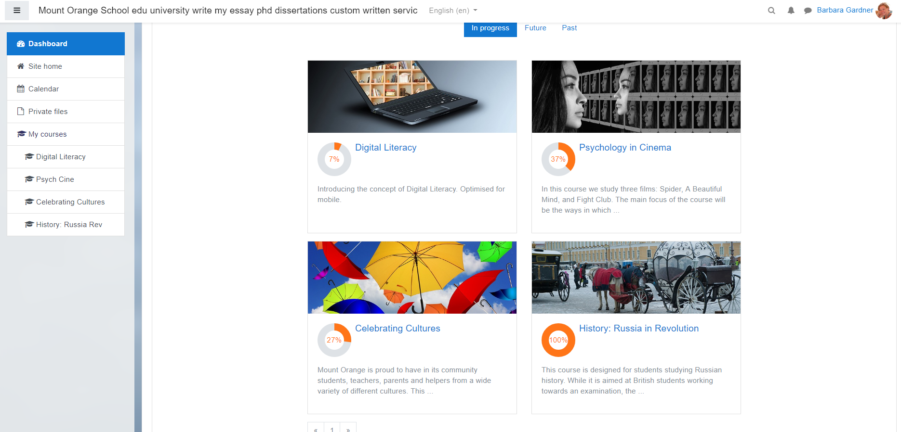
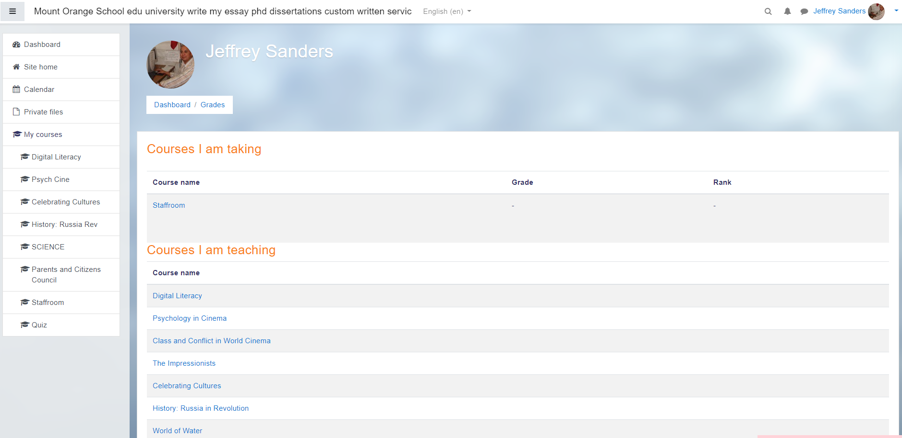
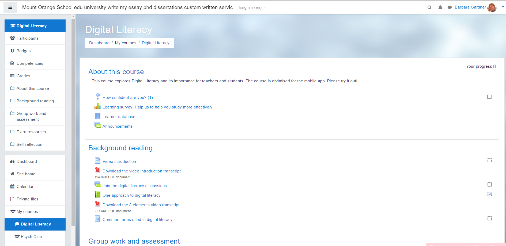
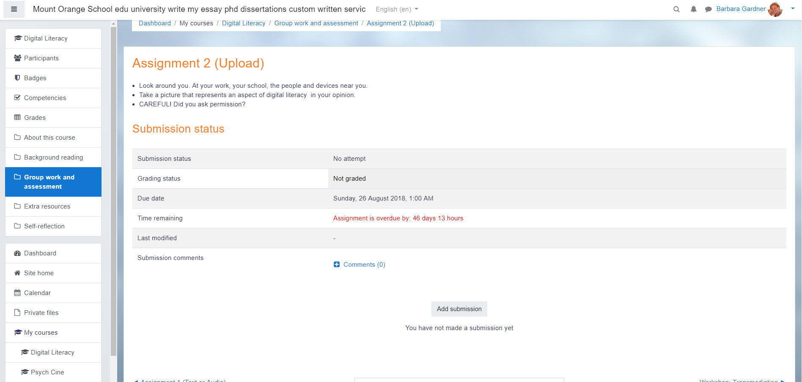
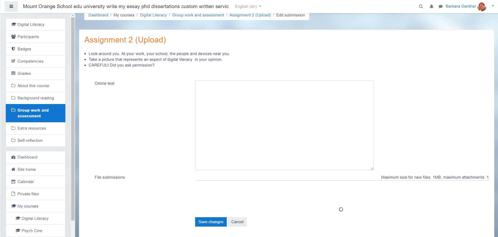
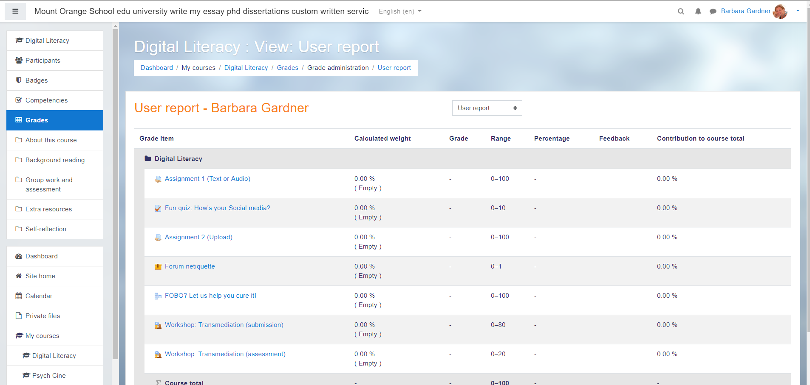
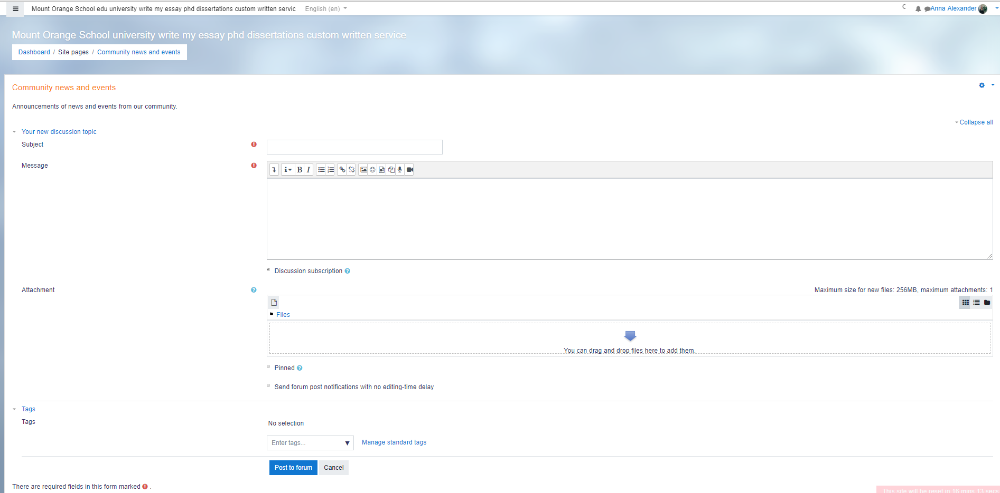
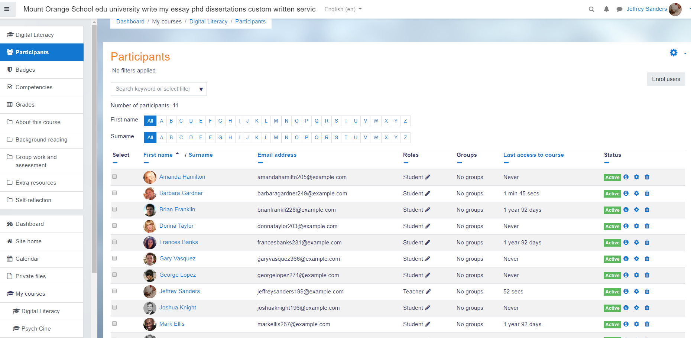

# 课程信息管理系统竞品报告

## 背景
课程信息管理系统（Course Information Management System，CIMS） 是指具有组织、呈现、管理和评价课程内容与教学活动，促进师生之间交互等一系列功能的计算机（网络）系统。它帮助教师利用信息技术支持课程教学，建构促进有效教学的信息化环境。

目前使用课程信息管理系统国内高校并不多，而且因每个学校的校情各异，大多根据个别院校自己的需求来定制，并且大多需要内网或者学生账号登录才能访问，难以找到可以对比的课程信息管理系统。国外流行的课程信息管理系统主要有三种，Moodle, Sakai, Blackboard，它们大多已经运行多年，功能比较成熟且完善，但其开发者针对的是以欧美为主的学校，其中很多流程和功能并不适用于国内高校。

在这种背景下，我们的竞品调研就只能对国外开源的已经比较成熟的课程信息管理系统进行分析，并且希望从中找到一些启发。

## 竞品列表
| 名称 | 开发单位 | 国家 | 服务器系统 | 数据库 |
| ---- | ---- | ---- | ----| ----|
| Moddle | Martin Dougiamas | 澳大利亚 | Window/Uninx| MySQL |
| Sakai | Sakai | 美国 | Window/Uninx| Oracle/MySQL |
| Blackboard | WebCTP | 美国 | Window/Uninx| Oracle/MySQL |

## 竞品功能对比
| 名称 | Moddle |Sakai |  Blackboard | 
| ---- | ---- | ---- | ----| 
| 讨论区  | ✔ | ✔ | ✔ |
| 上传作业| ✔ | ✔ | ✔ |
| 下载课件|   |   | ✔ |
| 发送邮件|   | ✔ | ✔ |
| 实时聊天| ✔ | ✔ | ✔ |
| 发布公告| ✔ | ✔ | ✔ |
| 课程搜索| ✔ | ✔ | ✔ |
| 课程测试| ✔ | ✔ | ✔ |
| 在线成绩薄| ✔ | ✔ | ✔ |
| 课程模板| ✔ | ✔ | ✔ |
| 学生注册登录| ✔ | ✔ | ✔ |
| 访客访问| ✔ | ✔ |  |

### 交互体验与视觉风格
学生界面

教师界面

学生课程页面

作业页面

上传作业页面

作业成绩页面

公告发布页面

教师管理学生页面

### 亮点特点借鉴
- 课程放在侧边栏
- 作业页面信息
- 课程创建可以设置模板
- 教师页面信息

## 总结
根据上面这些世界上流行的课程管理系统提供的功能，可以总结出课程管理系统（CMS）的基本功能有：
- 学生注册管理
- 课程目录与内容管理
- 教学活动与过程管理
- 学生学习过程评价与成绩管理
- 学习社区管理
还有一些带有跟踪和记录学习历程、管理者使用的汇总管理记录报告等功能。总的来说，这些系统的成熟造成了系统功能的复杂，个人感觉用户体验较差，功能太多很难快速找到自己想要的功能。我们团队致力于简单快捷地满足教师和学生的需求，要根据中山大学的特性定制我们的系统

