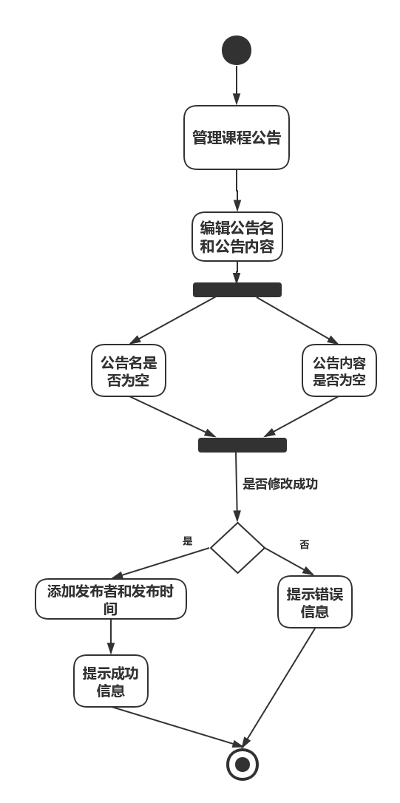

| 版本  | 日期       | 描述            | 作者   |
| ----- | ---------- | --------------- | ------ |
| 1.0.2 | 2018.10.30 | 管理课程公告用例 | 余广坝 |

**用例图：**

##### 用例规约：

## 2.0.1 管理课程公告
##### 1）简要说明
本用例允许教师或助教对课程公告信息进行新增、删除和修改

##### 2）参与者
教师或助教

##### 3）事件流
I.基本事件流
用例开始于教师或助教已登录后台管理系统，并且点击“课程公告”选项
- A.系统显示课程公告页面，包括公告名，公告内容，发布公告时间、发布公告者
- B.编辑课程公告名、公告内容

##### 4）特殊需求
自动填入发布公告时间和发布公告者

##### 5）前置条件
用例开始于教师或助教已登录后台管理系统，并且点击“课程公告”选项

##### 6）后置条件
如果本用例成功，系统将更改后公告信息更新到数据库，若失败，系统状态不变

##### 流程图：

