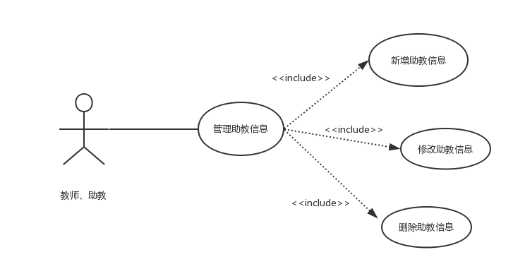
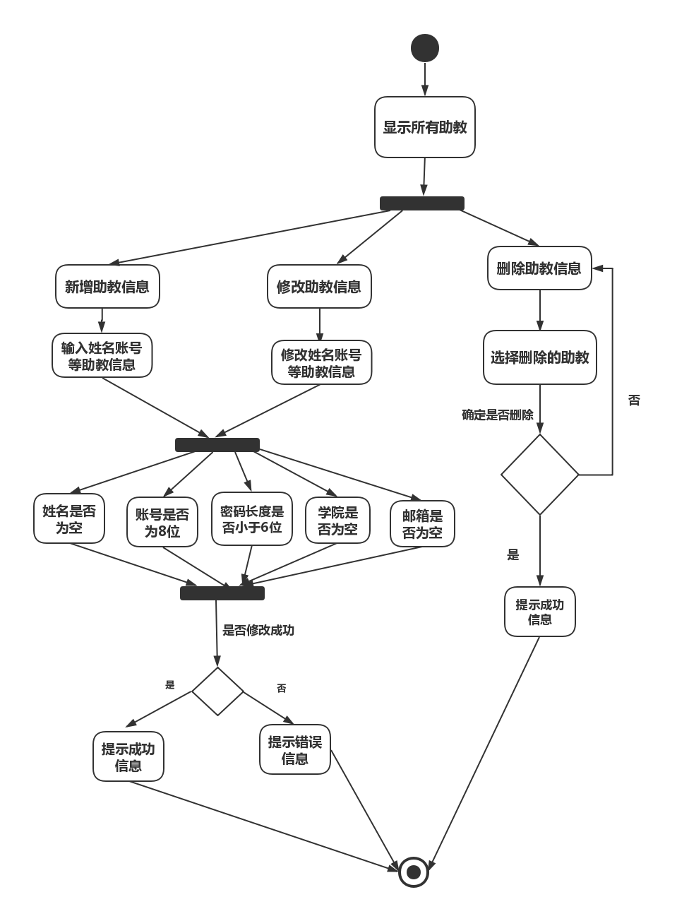

| 版本  | 日期       | 描述            | 作者   |
| ----- | ---------- | --------------- | ------ |
| 2 | 2018.10.30 | 管理课程助教用例 | 余广坝 |

**用例图：**

## 2.0.5 管理助教信息用例
##### 1）简要说明
本用例允许教师对助教信息进行新增、修改、删除、查询

##### 2）参与者
教师

##### 3）事件流
I.基本事件流
本用例开始于教师成功登陆后台管理系统并点击“管理助教信息”
- A.系统显示所有助教，包括姓名、帐号、学院、邮箱、助理课程
- B.教师点击“新增助教信息”按钮
>> A）输入助教姓名、帐号、密码、学院、邮箱等基本信息 
>> B) 点击“确定” 
>>>> B1:姓名为空 
>>>> B2：账号不为8位 
>>>> B3：密码长度小于6位 
>>>> B4：学院为空 
>>>> B4：邮箱为空 
>>C) 系统提示“新增助教信息成功”，并将新增助教信息更新到数据库，并显示到所有助教列表
- C.教师点击“修改助教信息”按钮
>> A）修改助教密码、学院、邮箱等基本信息 
>> B) 点击“确定” 
>>>> B1:姓名为空 
>>>> B2：账号不为8位 
>>>> B3：密码长度小于6位 
>>>> B4：学院为空 
>>>> B4：邮箱为空 
>> C) 系统提示“修改助教信息成功”，并将助教信息更新到数据库，并显示到所有助教列表
- D.教师点击“删除助教”按钮
>> A）选中需要删除的助教 
>> B) 点击“确定”<b
>> C) 系统提示“是否确定删除该助教” 
>> D) 以下一条子事件流将被执行 
>>>>      如果点击“确定”，将该助教信息在数据库标记为无效，系统提示“删除成功” 
>>>>      如果点击“取消”，返回基本事件流A 

II.后备事件流 
- B1：姓名为空
系统提示“请输入姓名”，返回基本事件流第三步 
- B2： 账号不为8位
系统提示“账号输入有误”，返回基本事件流第三步 
- B3： 密码长度小于6位
系统提示“密码长度不能小于6位”，返回基本事件流第三步 
- B4：学院为空
系统提示“请输入该教师所属学院”，返回基本事件流第三步 
- B5：邮箱为空
系统提示“请输入该教师的邮箱”，返回基本事件流第三步 

##### 4）特殊需求
助教姓名、账号不得修改

##### 5）前置条件
本用例开始于教师登录后台管理系统并且点击“管理助教信息”

##### 6）后置条件
如果本用例成功，系统将助教信息更新到数据库，若失败，系统状态不变

##### 流程图：

