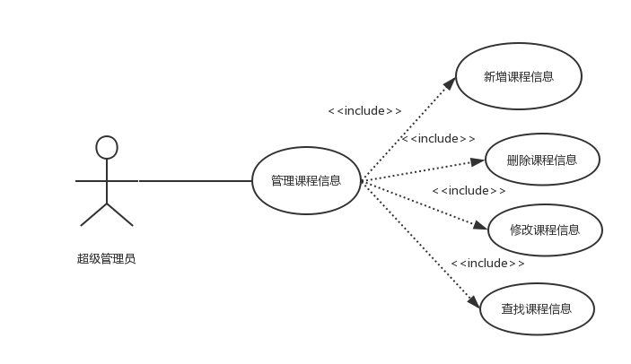
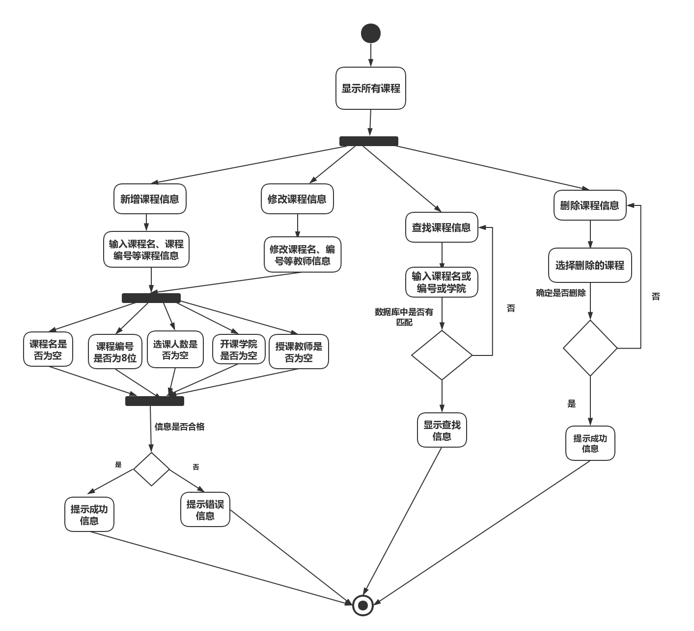

| 版本  | 日期       | 描述            | 作者   |
| ----- | ---------- | --------------- | ------ |
| 1.0.2 | 2018.10.29 | 管理课程信息用例 | 余广坝 |

**用例图：**

## 1.0.3 管理课程信息用例
##### 1）简要说明
本用例允许超级管理员对课程信息进行新增、修改、删除、查询

##### 2）参与者
超级管理员

##### 3）事件流
I.基本事件流
本用例开始于超级管理员成功登陆后台管理系统并点击“管理课程信息”
- A.系统显示所有课程，包括课程名、课程编号、开课学院、上课人数、授课教师
- B.超级管理员点击“新增课程信息”按钮
>> A）输入课程课程名、课程编号、开课学院、上课人数、授课教师等基本信息 
>> B) 点击“确定” 
>>>> B1:课程名为空 
>>>> B2：课程编号不为8位 
>>>> B3：开课学院是否为空 
>>>> B4：上课人数是否为空 
>>>> B5：授课教师是否为空 
>>C) 系统提示“新增课程信息成功”，并将新增课程信息更新到数据库，并显示到所有课程列表
- C.超级管理员点击“修改课程信息”按钮
>> A）修改开课学院、上课人数、授课教师基本信息 
>> B) 点击“确定” 
>>>> B1:课程名为空 
>>>> B2：课程编号不为8位 
>>>> B3：开课学院是否为空 
>>>> B4：上课人数是否为空 
>>>> B5：授课教师是否为空 
>> C) 系统提示“修改课程信息成功”，并将课程信息更新到数据库，并显示到所有课程列表
- D.超级管理员点击“删除课程”按钮
>> A）选中需要删除的课程 
>> B) 点击“确定” 
>> C) 系统提示“是否确定删除该课程” 
>> D) 以下一条子事件流将被执行 
>>>>      如果点击“确定”，将该课程信息在数据库标记为无效，系统提示“删除成功” 
>>>>      如果点击“取消”，返回基本事件流A 
- E.超级管理员点击“查找课程”
>> A) 搜索框输入课程名或课程编号或开课学院进行查询 
>> B) 如果查找内容与数据库匹配则显示查找内容，如果内容与数据库不匹配则提示“系统中无此课程信息” 

II.后备事件流 
- B1：姓名为空
系统提示“请输入=课程名”，返回基本事件流第三步 
- B2： 账号不为8位
系统提示“课程编号输入错误”，返回基本事件流第三步 
- B3： 密码长度小于6位
系统提示“开课学院不能为空”，返回基本事件流第三步 
- B4：学院为空
系统提示“上课人数不能为空”，返回基本事件流第三步 
- B5：邮箱为空
系统提示“授课教师不能为空”，返回基本事件流第三步 

##### 流程图：

