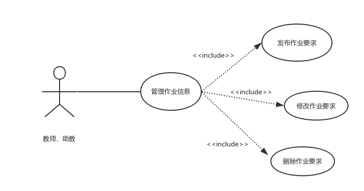
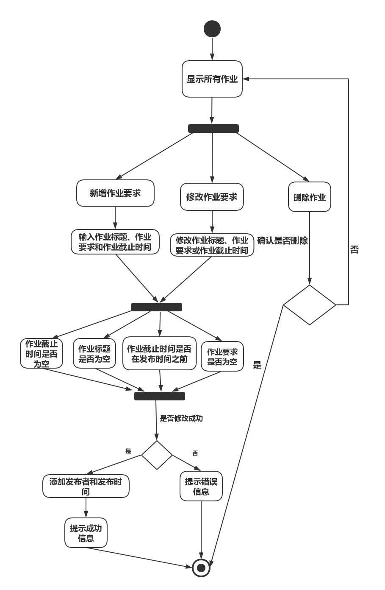

| 版本  | 日期       | 描述            | 作者   |
| ----- | ---------- | --------------- | ------ |
| 2 | 2018.10.30 | 管理课程作业用例 | 余广坝 |

**用例图：**

##### 用例规约：

## 2.0.2 管理课程作业
##### 1）简要说明
本用例允许教师或助教对课程作业要求进行新增、删除和修改

##### 2）参与者
教师或助教

##### 3）事件流
I.基本事件流
用例开始于教师或助教已登录后台管理系统，并且点击“课程作业”选项
- A.系统显示课程作业列表，包括作业标题，作业要求，发布作业时间、发布作业者、作业提交截止时间
- B.选择新增课程作业，输入作业标题、作业要求、作业提交截止时间
>>B1：作业标题为空 
>>B2：作业要求为空 
>>B3：作业提交截止时间为空 
>>B4：作业提交截止时间设置为作业发布时间之前 

- C.选择修改课程作业要求，修改作业标题、作业要求或作业提交截止时间
>>B1：作业标题为空 
>>B2：作业要求为空 
>>B3：作业提交截止时间为空 
>>B4：作业提交截止时间设置为作业发布时间之前 

- D.选择删除课程课程，判断是否确认删除
 

II.后备事件流
B1：作业标题为空，系统提示“作业标题不能为空”，返回基本事件流第三步
B2：作业内容为空，系统提示“作业要求不能为空”，返回基本事件流第三步
B3：作业提交截止时间为空，系统提示“作业提交截止时间不能为空”，返回基本事件流第三步
B4：作业提交截止时间设置为作业发布时间之前，系统提示“作业提交截止时间设置错误”，返回基本事件流第三步

##### 4）特殊需求
自动填入发布作业时间和发布作业者

##### 5）前置条件
用例开始于教师或助教已登录后台管理系统，并且点击“课程作业”选项

##### 6）后置条件
如果本用例成功，系统将更改后作业信息更新到数据库，若失败，系统状态不变

##### 流程图：

