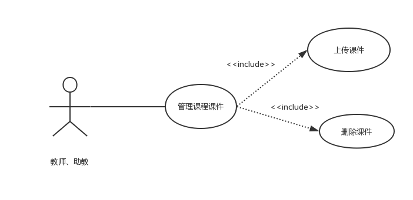
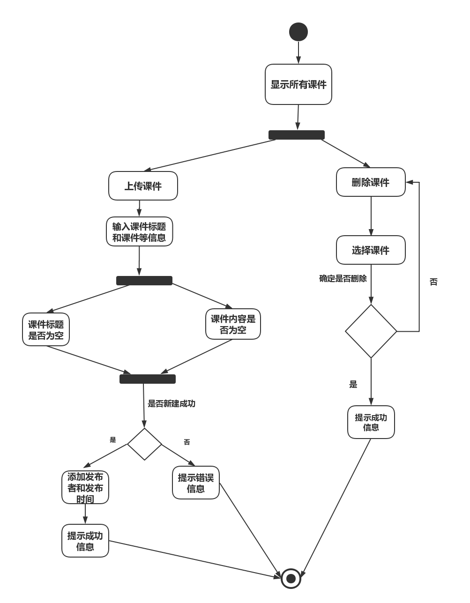

| 版本  | 日期       | 描述            | 作者   |
| ----- | ---------- | --------------- | ------ |
| 2.0 | 2018.10.30 | 管理课程课件用例 | 余广坝 |

**用例图：**

##### 用例规约：

## 2.0.2 管理课程课件
##### 1）简要说明
本用例允许教师或助教对课程课件进行上传和删除

##### 2）参与者
教师或助教

##### 3）事件流
I.基本事件流
用例开始于教师或助教已登录后台管理系统，并且点击“课程课件”选项
- A.系统显示课程课件列表，包括课件标题、备注、发布课件时间、发布课件者
- B.选择“上传课件”，输入课件标题、备注、上传课件
>>B1：课件标题为空 
>>B2：课件内容为空
- C.选择“删除课程课件”
>> A）选中需要删除的课件 
>> B) 点击“确定” 
>> C) 系统提示“是否确定删除该课件” 
>> D) 以下一条子事件流将被执行 
>>>>      如果点击“确定”，将该课件信息在数据库标记为无效，系统提示“删除成功” 
>>>>      如果点击“取消”，返回基本事件流A 
 

II.后备事件流
- B1：课件标题为空，系统提示“课件标题不能为空”，返回基本事件流第一步 
- B2：课件内容为空，系统提示“课件内容不能为空，请先上传课件”，返回基本事件流第一步

##### 4）特殊需求
自动填入发布课件时间和发布课件者

##### 5）前置条件
用例开始于教师或助教已登录后台管理系统，并且点击“课程课件”选项

##### 6）后置条件
如果本用例成功，系统将更改后课件信息更新到数据库，若失败，系统状态不变

##### 活动图：

