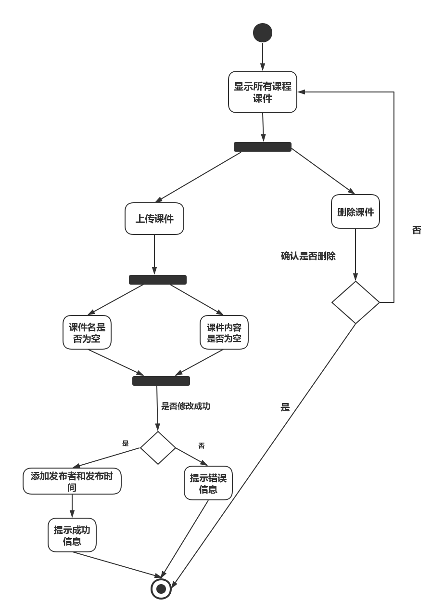

| 版本  | 日期       | 描述            | 作者   |
| ----- | ---------- | --------------- | ------ |
| 1.0.2 | 2018.10.30 | 管理课程课件用例 | 余广坝 |

**用例图：**

##### 用例分析：

|     用例名称     | 管理课程课件                                 |
| :----------: | :--------------------------------------- |
|      范围      | web应用                                    |
|      级别      | 用户目标                                     |
|    主要参与者     | 教师或助教                                  |
|   涉众及其关注点    | 上传或删除课件           |
|     前置条件     | 教师或助教登录成功                   |
| 成功保证（或后置条件）  | 教师或助教输入的信息准确无误                    |
| 主成功场景（或基本流程） | 1. 新增课程课件  2. 删除课程课件  |
|  扩展（或替代流程）   | 课件关键信息为空时提示操作有误  |
|     特殊需求     |	界面友好亲和，无须指导即可操作                      |
|     发生频率     | 经常发生                                   |

##### 流程图：

