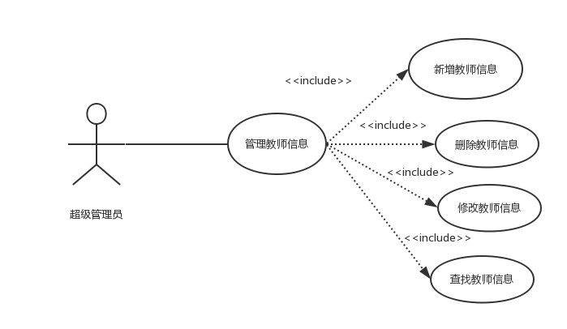
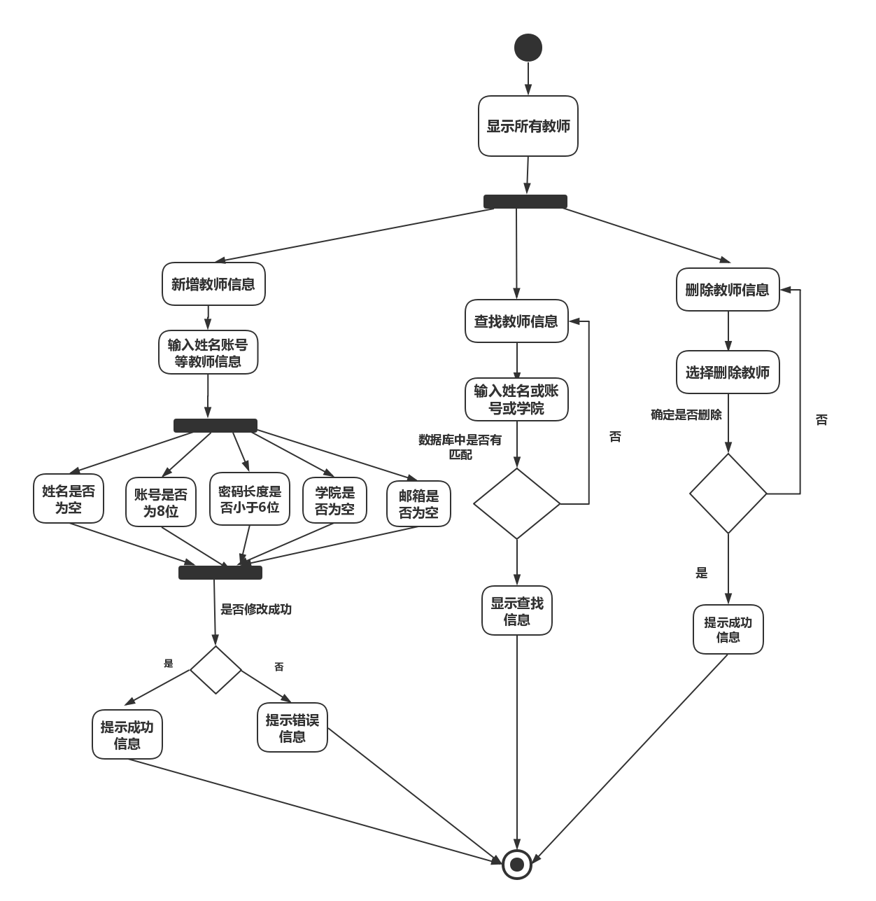

| 版本  | 日期       | 描述            | 作者   |
| ----- | ---------- | --------------- | ------ |
| 1.0.2 | 2018.10.29 | 管理教师信息用例 | 余广坝 |

**用例图：**

## 3.0.1 管理教师信息用例
##### 1）简要说明
本用例允许超级管理员对教师信息进行新增、修改、删除、查询

##### 2）参与者
超级管理员

##### 3）事件流
I.基本事件流
本用例开始于超级管理员成功登陆后台管理系统并点击“管理教师信息”
- A.系统显示所有教师，包括姓名、帐号、联系方式、学院、邮箱、授课课程
- B.超级管理员点击“新增教师信息”按钮
>> A）输入教师姓名、帐号、密码、学院、邮箱等基本信息 
>> B) 点击“确定” 
>>>> B1:姓名为空 
>>>> B2：账号不为8位 
>>>> B3：密码长度小于6位 
>>>> B4：学院为空 
>>>> B4：邮箱为空 
>>C) 系统提示“新增教师信息成功”，并将新增教师信息更新到数据库，并显示到所有教师列表
- C.超级管理员点击“修改教师信息”按钮
>> A）修改教师密码、学院、邮箱等基本信息 
>> B) 点击“确定” 
>>>> B1:姓名为空 
>>>> B2：账号不为8位 
>>>> B3：密码长度小于6位 
>>>> B4：学院为空 
>>>> B4：邮箱为空 
>> C) 系统提示“修改教师信息成功”，并将教师信息更新到数据库，并显示到所有教师列表
- D.超级管理员点击“删除教师”按钮
>> A）选中需要删除的教师 
>> B) 点击“确定” 
>> C) 系统提示“是否确定删除该教师” 
>> D) 以下一条子事件流将被执行 
>>>>      如果点击“确定”，将该教师信息在数据库标记为无效，系统提示“删除成功” 
>>>>      如果点击“取消”，返回基本事件流A 
- E.超级管理员点击“查找教师”
>> A) 搜索框输入姓名或账户或学院进修查询 
>> B) 如果查找内容与数据库匹配则显示查找内容，如果内容与数据库不匹配则提示“系统中无此教师信息” 

II.后备事件流 
- B1：姓名为空
系统提示“请输入姓名”，返回基本事件流第三步 
- B2： 账号不为8位
系统提示“账号输入有误”，返回基本事件流第三步 
- B3： 密码长度小于6位
系统提示“密码长度不能小于6位”，返回基本事件流第三步 
- B4：学院为空
系统提示“请输入该教师所属学院”，返回基本事件流第三步 
- B5：邮箱为空
系统提示“请输入该教师的邮箱”，返回基本事件流第三步 

##### 4）特殊需求
教师姓名、账号不得修改

##### 5）前置条件
本用例开始于超级管理员登录后台管理系统并且点击“管理教师信息”

##### 6）后置条件
如果本用例成功，系统将教师信息更新到数据库，若失败，系统状态不变

##### 流程图：

