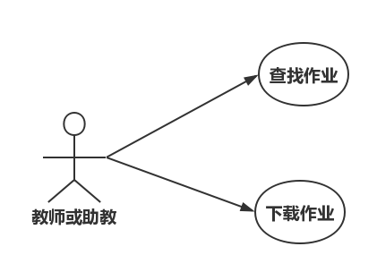
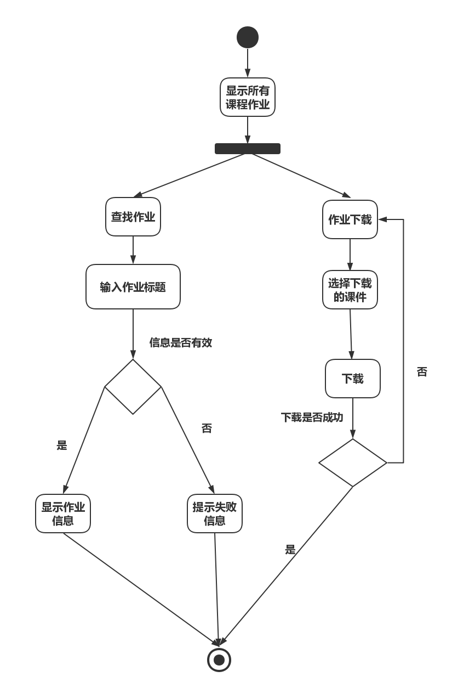

**用例图：**

|     用例名称     | 下载作业                              |
| :----------: | :--------------------------------------- |
|     用例编号      | 2.0.4                                     |
|    主要参与者     | 教师或助教                                       |
|   涉众及其关注点    | 顾客：希望能准确、简便地取消订单。                        |
|     前置条件     | 教师或助教登录后台管理系统并点击“作业下载”          |
| 成功保证（或后置条件）  | 选择的作业将被打包下载到本地计算机                |
| 主成功场景（或基本流程） | A.系统显示所有课程作业 B.教师或助教提交点击“作业下载”按钮 C.教师或助教输入作业标题搜索作业，如果数据库中有匹配的标题则显示，没有则显示“查询无该作业”|
|     特殊需求     | 作业按时间倒序排列显示                         |
|     发生频率     | 偶尔会发生。                                   |

##### 流程图：

