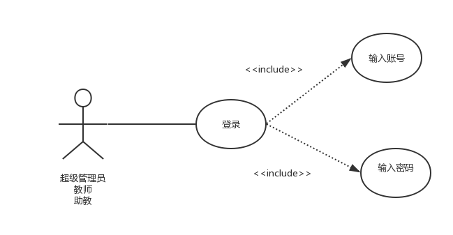
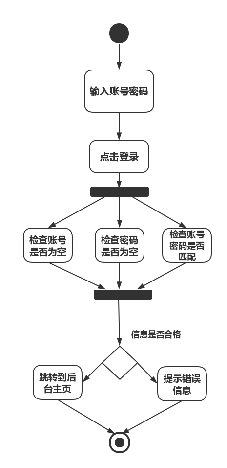

| 版本  | 日期       | 描述            | 作者   |
| ----- | ---------- | --------------- | ------ |
| 1.0.2 | 2018.10.29 | 登录 | 余广坝 |

**用例图：**

##### 基本用例：

- 餐厅登录：输入账号名、密码；

##### 选做用例：

- 忘记密码：邮箱验证码或链接验证【待定】，重置密码；

##### 用例名称：
课程信息管理系统

##### 用例范围：
web网页

##### 用例级别：
用户目标

##### 主要参与者：
超级管理员、教师、助教

##### 涉众及其关注点：

超级管理员：希望能登录为超级用户，管理教师信息和课程信息
教师：希望登录成为教师用户，发布课程公告、课件、作业，下载学生作业，管理助教信息
助教：希望登录成为助教用户，发布课程公告、课件、作业，下载学生作业

##### 前置条件：

​	管理员了解系统的登录流程；

##### 后置条件：

​	管理员登录过程输入的信息准确无误；

##### 基本流程：

- 管理员登录系统，输入账号名、密码，验证通过后登录成功；

##### 特殊需求：

​	界面友好亲和，无须指导即可操作；

##### 发生频率：

​	经常发生；

##### 未决问题：

​	安全性问题；

##### 流程图：

