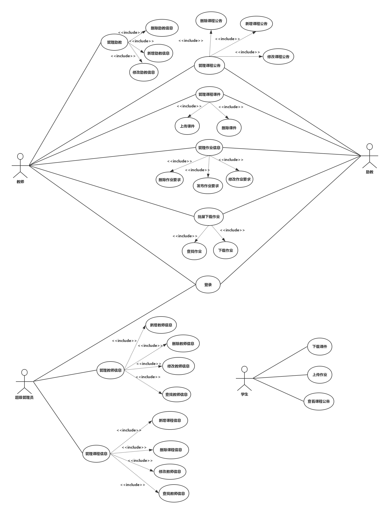

下图为整个系统的用例一览，在img_use_case文件夹中亦有各个子用例图。 

# 用例文本与活动图
整个系统按照业务划分为下面几个用例，用例文本引用了子用例图，并添有必要的活动图辅助说明。
**基本用例：**
 -  [登录](login.md)：超级管理员、教师、助教可以登录系统。
 -  [管理教师信息](admin_teacher.md)：超级管理员管理教师基本信息。
 -  [管理课程信息](admin_course.md)：超级管理员管理课程基本信息。
 
 -  [管理课程公告](admin_announcement.md)：教师、助教管理课程公告。
 -  [管理课程课件](admin_ppt.md)：教师、助教管理课程课件。
 -  [管理课程作业](admin_homework.md)：教师、助教管理课程作业信息。
 -  [下载学生作业](download_homework.md)：教师、助教下载学生作业。
 -  [管理课程公告](admin_assistant.md)：教师管理助教基本信息。
 
 -  [学生端功能](student.md)：学生上传作业、下载课件、查看课程公告。
 
 
