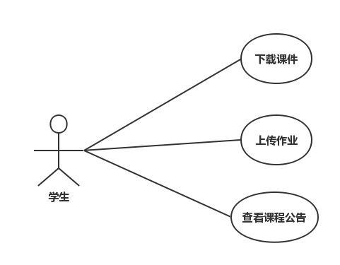
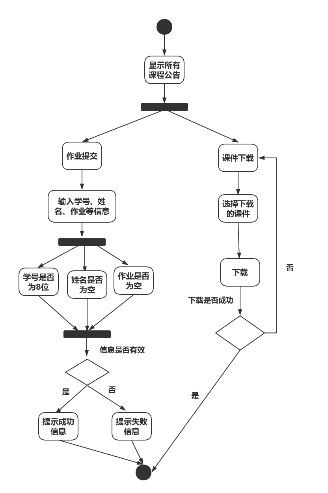

| 版本  | 日期       | 描述            | 作者   |
| ----- | ---------- | --------------- | ------ |
| 2.0 | 2018.10.30 | 学生端功能用例 | 余广坝 |

**用例图：**

## 3.0.1 学生端功能
##### 1）简要说明
本用例允许学生用户查看课程公告，下载课程课件，上传课程课件

##### 2）参与者
学生用户

##### 3）事件流
I.基本事件流
本用例开始于学生打开课程网站主页
- A.系统显示最新课程公告信息，包括课程公告标题、课程公告内容、课程公告发布者、课程公告发布时间
- B.学生点击“作业提交”页面
>> A）显示作业列表 
>> B) 选择需要提交的作业 
>> C）输入学号、姓名、备注（可选），上传作业文件
>>>> B1:学号不为8位 
>>>> B2：姓名为空 
>>>> B3：文件内容为空
>> D) 系统提示“作业上传成功”，作业信息会更新到数据库，并显示到作业提交列表
- C.学生点击“课件下载”页面
>> A) 显示课件列表 
>> B) 选择下载需要的课件

 
II.后备事件流
- B1： 学号不为8位
系统提示“学号输入有误”，返回事件流第二步 
- B2：姓名为空
系统提示“请输入姓名”，返回事件流第二步 
- B3：文件内容为空
系统提示“请先上传文件”，返回事件流第二步 

##### 4）特殊需求
学生提交作业后可以看到自己的提交记录 
课程公告按时间倒序排列

##### 5）前置条件
本用例开始于学生正确打开课程网站主页

##### 6）后置条件
如果本用例成功，系统将作业提交信息更新到数据库，若失败，系统状态不变

##### 活动图：

