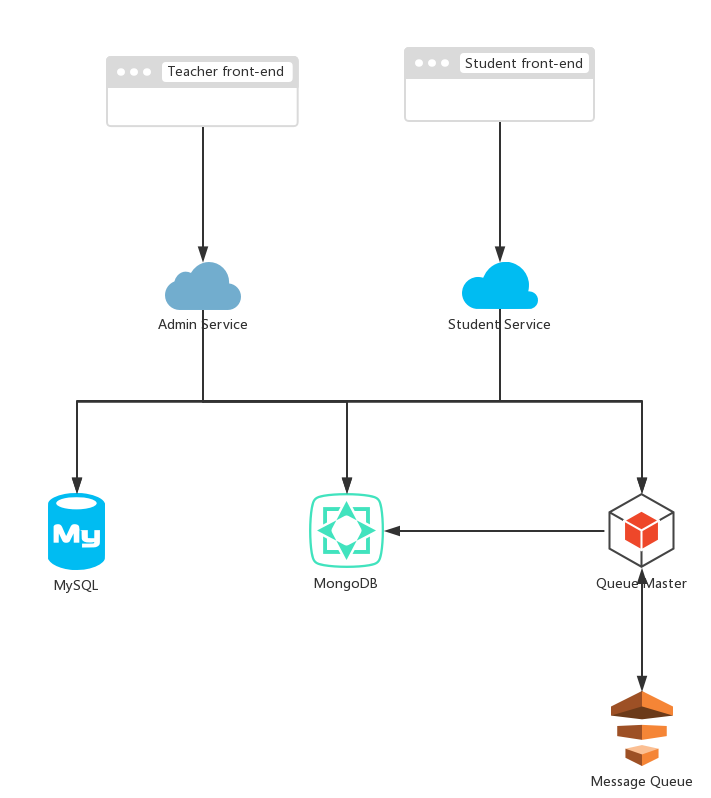

# Software Architecture Document

## 架构问题

### 可靠性和可恢复性

* 因素：网站使用过程中出现访问服务端中断问题并进行恢复
* 度量和质量场景：当网页访问服务端中断时，在正常的工作环境下，如果在15s内检测到其恢复，则重新建立连接
* 可变性：在能够重新建立连接之前，可以在客户端进行简化服务
* 可扩展的结构：服务端需要一个可扩展的结构对服务进行分层，从而兼顾开发效率和运行效率。
* 自动测试与部署：为了简化运维难度，需要在软件架构中考虑并设计自动测试与部署方案
* 对于成功的优先级 ：高
* 困难或风险：中等

## 解决方案说明

### 如何提高服务器性能

* 增加服务器内存
* 限制同时服务的最多用户数，避免服务器负载超荷
* 将动态数据存储到缓存文件中，前端直接调用这些文件，而不必再访问数据库
* 优化数据库的查询SQL，避免使用代价高昂的查询，每次查询只返回自己需要的结果；避免短时间内的大量SQL查询
* 数据库适当建立索引
* 数据库定期备份，当数据库出现操作失误或系统故障导致数据丢失时可以恢复数据
* 服务器采用Docker和Kubernetes部署，因此可以快速部署多个服务器实例，通过Kubernetes的LoadBalence组件进行负载均衡
* 服务端使用Spring Boot和Flask进行开发，严格遵守MVC模式，当有新的功能需求时可以通过增加对应Model和Controller方便进行更新

## 逻辑视图

## 物理视图

