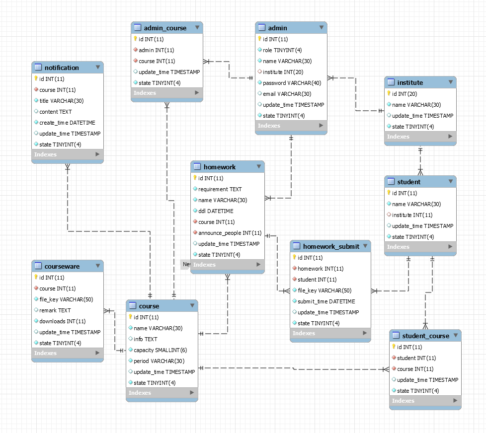

# ER图
下图为系统基础框架所需的完整数据库设计

#### 系统分为管理员端和学生端。 
1. 学生端无需登录，只需输入自己学号或姓名查找课程即可查看该课程的通知、下载课件和提交作业。
2. 管理员端分为管理员、教师和助教三个角色。
&ensp;（1）助教功能有：
&ensp;&ensp;* 对课程信息的增删改查，包括课程通知、课件、作业要求以及选课学生
&ensp;&ensp;* （对指定课程）作业批量下载、查看未提交作业的学生
&ensp;（2）教师功能有：
&ensp;&ensp;* 包含所有助教角色的功能
&ensp;&ensp;* 登录、修改密码
&ensp;&ensp;* 指定课程助教
&ensp;（2）教师功能有：
&ensp;&ensp;* 包含所有教师角色的功能
&ensp;&ensp;* 对老师、助教、学生、课程的增删改查