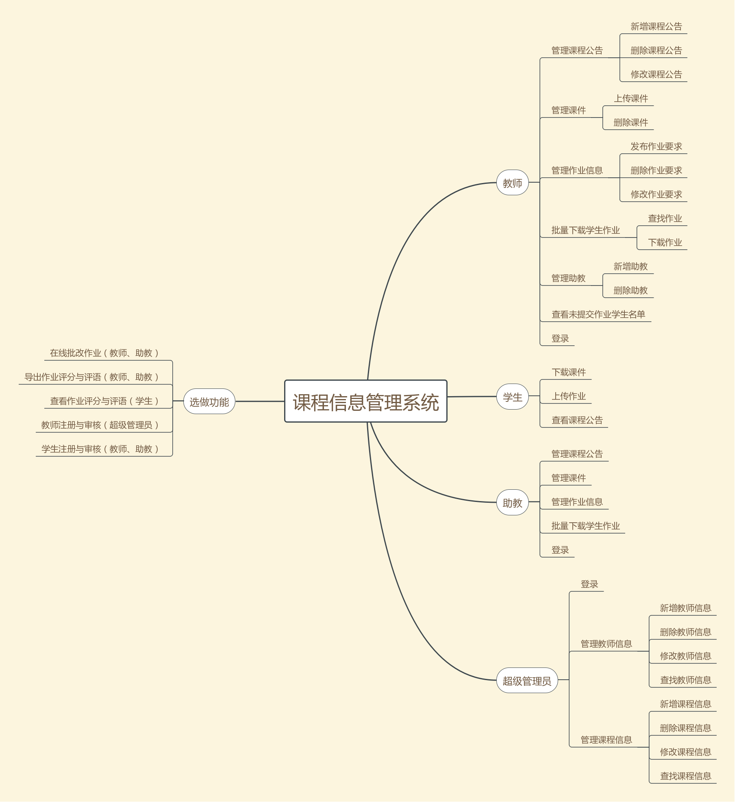

# Meeting Record of Iteration1

`2018/3/29 21:30 - 22:45`

**会议目标：**
交流所做的调研和准备，确定核心需求，就第一轮迭代阶段的任务讨论达成共识

## 议程

1. 确定主要功能，建立初步用例模型
2. 制定人员分工及调研、开发计划

## 讨论结果

1. 主要功能

主要角色：超级管理员、老师、助教、学生
	1. 管理员（超级用户)：
		1. 登录
		2. 增删改查老师
		3. 创建课程
		4.（老师注册的审核，后续功能）
	2. 管理员（老师）：
		1. 登陆
		2. 对课堂信息增删改查
				1. 公告
				2. 课件
				3. 作业要求
				4. 管理课堂里面的学生
				5. 指定课程助教
		3. 作业批量下载、查看未提交作业的学生
		4. 对课堂里面的学生发通知
		5. （注册，后续功能）
		6. （在线改作业：写评语，给评分，导出来CSV，后续功能）
	3. 学生：
		1. 用URL进入课程页面
			1. 交作业（输入自己学号和姓名）
			2. 下课件
			3. 看通知
			4. （查看作业评分与评语，后续功能）
	4. 管理员（助教）：
                1. 除了（指定课程助教）以外的所有老师功能

### 第一个迭代分工

- 架构设计、前端选型及开发：关子杰
- 架构设计、后端选型及开发：霍兆亨
- API文档、前端选型及开发、消息队列开发：廖维明
- 负责素材收集、UML图、各个迭代阶段的产品报告：余广坝

